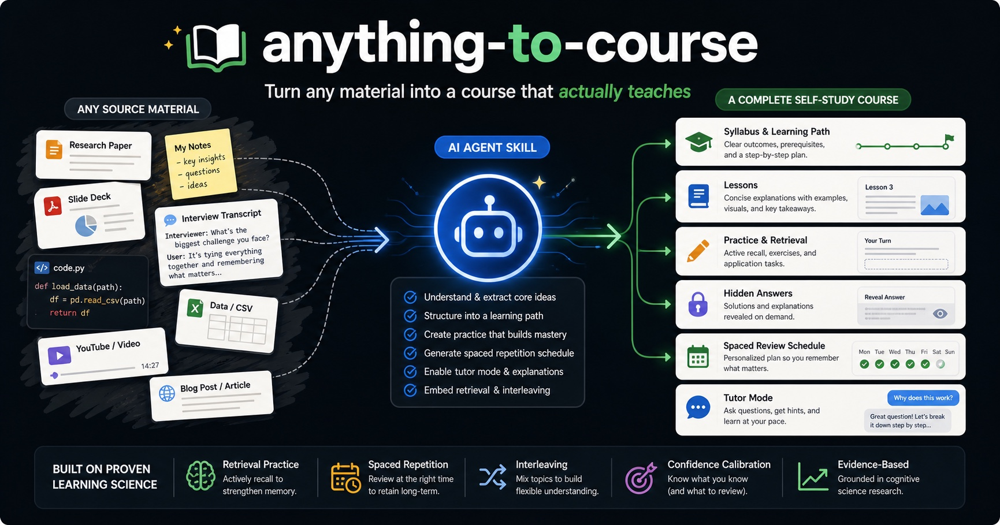

# anything-to-course

**Turn any material into a course that actually teaches. Built on learning science, not content dumps.**

  

<p align="center">
  
</p>

A universal AI agent skill that turns documents, notes, books, transcripts, slides, codebases — or just a topic — into a complete self-study course, then runs your study sessions as a tutor. Built and tested on Claude Code; designed for Claude.ai, OpenAI Codex, Gemini CLI, Cursor, and any agent that can read a `SKILL.md` folder.

---

## What this is

`anything-to-course` is a portable course-design workflow for AI agents. It does not just summarize source material. It turns material into observable capabilities, lessons, practice, feedback, checkpoints, and a spaced review plan.

```
Source material       Capability map       Course build          Study mode
      |                    |                    |                    |
      v                    v                    v                    v
Docs, notes,  -->  outcomes, gaps  -->  lessons, tasks,  -->  retrieval,
slides, code       prerequisites        hidden answers        calibration,
or a topic          module order         review schedule       tutoring
```

## Quick demo

Ask your agent:

```text
Use the anything-to-course skill.
Turn ./docs/sql-handbook into a 3-week self-study course for analysts
who know Excel but have never written SQL.
Make learners practice before reading answers.
```

You get a course package with a syllabus, modules, lessons, hidden answer files, checkpoints, and a review schedule:

```text
sql-for-analysts/
├── 00-syllabus.md
├── modules/
│   ├── 01-filtering-rows/
│   └── 02-aggregation/
├── answers/
└── review-schedule.md
```

See the generated example in [`examples/example-course/sql-for-analysts/`](examples/example-course/sql-for-analysts/).

## The problem

Ask an AI to "make a course from this" and you get a **content dump**: well-formatted explanations, a cheerful summary, and a recognition quiz at the end. It reads smoothly. It feels clear. And it evaporates within a week — because *feeling of understanding* and *ability to act* are different outcomes, and rereading fluent text only produces the first one.

Decades of cognitive science are unambiguous about what produces durable capability: **effortful retrieval, spaced re-encounters, interleaved discrimination practice, feedback after (never before) an attempt, and support that fades**. Almost no AI-generated course uses any of it.

This skill hard-wires all of it into every course it builds.

## What you get

Give it source material and an audience. It produces a structured course:

```
your-course/
├── 00-syllabus.md            # observable capabilities, module map, how to study
├── modules/
│   ├── 01-foundations/
│   │   ├── 00-overview.md    # outcomes, prerequisites, entry diagnostic
│   │   ├── 01-....md         # lessons: attempt → principle → worked example
│   │   │                     #   → contrast → practice with fading support
│   │   └── 99-checkpoint.md  # mixed practice, methods not named
│   └── ...
├── answers/                  # feedback & explanations — physically separate,
│                             #   so answers can't be seen before the attempt
└── review-schedule.md        # spaced repetition plan (+1d, +7d, +30d)
```

Every lesson follows an 11-step canonical flow where the learner **attempts before reading the explanation**, retrieves from memory before seeing options, rates confidence before checking, and gets feedback that explains the *cause* of the error and demands a retry.

## See it before you run it

**[`examples/example-course/sql-for-analysts/`](examples/example-course/sql-for-analysts/)** is a complete, unedited course produced by this skill — syllabus, two modules, checkpoints, separated answer files, and a review schedule. Open any lesson and compare it with what "make me a course on SQL" gives you in a raw chat: the difference *is* the skill. A one-file taste: [`examples/sample-lesson.md`](examples/sample-lesson.md).

The skill also shows you a **sample lesson first** on every run — one representative lesson in ~5 minutes for your sign-off on depth and tone — before building the full course.

## Prerequisites

- An AI agent that can read local files: Claude Code, Claude.ai / Claude Desktop, OpenAI Codex, Gemini CLI, Cursor, or a similar tool.
- Git, if you want to clone the repository.
- Source material: docs, notes, PDFs, transcripts, slides, code, links you paste in, or just a topic brief.

No package manager, database, API key, or network access is required by the skill itself.

## Install

### Claude Code

```bash
git clone https://github.com/lowwwbank/anything-to-course.git ~/.claude/skills/anything-to-course
```

Then just ask:

> Turn ~/docs/sql-handbook/ into a 3-week course for analysts who know Excel but not SQL.

### Claude.ai / Claude Desktop

Zip this folder and upload it under **Settings → Capabilities → Skills**, then ask Claude to build a course from your material.

### OpenAI Codex CLI

```bash
mkdir -p ~/.agents/skills
git clone https://github.com/lowwwbank/anything-to-course.git ~/.agents/skills/anything-to-course
```

### Repo-scoped install

If you want a project-local skill, vendor it inside the current repo:

```bash
mkdir -p .agents/skills
git clone https://github.com/lowwwbank/anything-to-course.git .agents/skills/anything-to-course
```

### Cursor, Gemini CLI, or any other agent

Place this folder wherever your agent can read it, then tell the agent to use `SKILL.md`. The skill is plain markdown: no scripts, no dependencies, no network access required.

### Copy-paste only

If your agent does not support local skill folders, copy the contents of [`SKILL.md`](SKILL.md) into the agent's custom instructions or prompt window, then attach or paste your source material.

## Run your first course

```text
Use the anything-to-course skill.
Turn <your source material> into a self-study course for <audience>.
Target outcome: learners should be able to <observable capability>.
Time budget: <duration>.
```

## How it works

1. **Intake** — audience, prior knowledge, target capabilities, time budget, stakes.
2. **Capabilities, not topics** — the material becomes 3–8 observable outcomes ("given X, the learner can Y to standard Z"). Content that serves no capability is cut.
3. **Dependency mapping** — modules ordered by what-builds-on-what, not by the source's table of contents. One lesson = one capability.
4. **Sample lesson first** — one representative lesson for your sign-off before the full build; style mismatches cost one lesson to fix, not a course.
5. **Lessons via the canonical flow** — real problem → learner attempt → principle → worked example (with the *why* of each step) → contrasting case → self-explanation → completion task → independent task → feedback → retry → exit ticket.
6. **Retention engineering** — exit tickets reach back to earlier lessons, cumulative checkpoints interleave modules, and `review-schedule.md` schedules retrieval at +1 day, +7 days, +21–30 days.
7. **Quality gate** — the finished course is audited against a 40-item author checklist and an anti-pattern list before delivery.
8. **Study mode** — afterwards, the same skill runs your sessions as a tutor: retrieval-first quizzing, confidence calibration, spaced reviews from the schedule, and a study log ([`references/study-mode.md`](references/study-mode.md)).

## The science

Every design rule traces to published research — mostly meta-analyses:

| Design rule | Evidence |
|---|---|
| Practice by retrieval, not rereading | [Rowland 2014](https://pubmed.ncbi.nlm.nih.gov/25150680/) · [Adesope et al. 2017](https://doi.org/10.3102/0034654316689306) · [Yang et al. 2021](https://doi.org/10.1037/bul0000309) |
| Attempt before explanation | [Sinha & Kapur 2021 (productive failure)](https://doi.org/10.3102/00346543211019105) · [Pan & Carpenter 2023 (pretesting)](https://doi.org/10.1007/s10648-023-09814-5) |
| Spaced reviews, relearning to criterion | [Dunlosky et al. 2013](https://doi.org/10.1177/1529100612453266) · [Rawson & Dunlosky 2013](https://doi.org/10.1007/s10648-013-9240-4) |
| Worked examples that fade with expertise | [van Gog, Paas & Sweller 2010](https://doi.org/10.1007/s10648-010-9145-4) · [expertise reversal meta-analysis 2025](https://doi.org/10.1016/j.learninstruc.2025.102142) |
| Directed self-explanation prompts | [Bisra et al. 2018](https://eric.ed.gov/?id=EJ1186664) · [Chi & Wylie 2014 (ICAP)](https://doi.org/10.1080/00461520.2014.965823) |
| Interleaving for tool selection | [Brunmair & Richter 2019](https://pubmed.ncbi.nlm.nih.gov/31556629/) |
| Feedback after the attempt, cause-level, with retry | [Wisniewski, Zierer & Hattie 2020](https://doi.org/10.3389/fpsyg.2019.03087) · [Shute 2008](https://doi.org/10.3102/0034654307313795) |
| Confidence calibration against the fluency illusion | [Koriat & Bjork 2005](https://doi.org/10.1037/0278-7393.31.2.187) |
| Terms defined before first use | [Mayer 2017 (pre-training)](https://doi.org/10.1111/jcal.12197) · [Shatz 2023 (curse of knowledge)](https://doi.org/10.1111/test.12320) |
| Concrete example → abstract principle | [Fyfe et al. 2014 (concreteness fading)](https://doi.org/10.1007/s10648-014-9249-3) |
| Goals ↔ practice ↔ assessment alignment | [Biggs 1996 (constructive alignment)](https://doi.org/10.1007/BF00138871) |
| Debriefed MCQ distractors | [Roediger & Marsh 2005](https://pubmed.ncbi.nlm.nih.gov/16248758/) |
| AI grading only with rubrics | [Jukiewicz & Wyrwa 2026](https://doi.org/10.3390/app16020680) |

The full principle set with conflict-resolution rules lives in [`references/learning-science.md`](references/learning-science.md).

## What this skill refuses to do

Honest constraints, by design:

- ❌ No walls of explanation with a quiz bolted on the end
- ❌ No answers visible before the learner's attempt
- ❌ No recognition-only testing ("which of these is the definition of...")
- ❌ No new jargon used before it's defined for *this* audience
- ❌ No single example without a contrast or counterexample
- ❌ No topic ordering copied from the source's table of contents
- ❌ No "reread and highlight" as a study strategy
- ❌ No optimizing for completion speed and satisfaction over delayed performance
- ❌ No invented facts to pad thin source material — gaps get flagged instead

The full anti-pattern list is in [`references/quality-rubrics.md`](references/quality-rubrics.md).

## Repository structure

```
anything-to-course/
├── SKILL.md                        # the skill: workflow the agent follows
├── references/
│   ├── learning-science.md         # 18 principles + research citations
│   ├── course-blueprint.md         # canonical course/module/lesson templates
│   ├── practice-design.md          # practice matrix, question & feedback design
│   ├── quality-rubrics.md          # author checklist, case rubric, anti-patterns
│   └── study-mode.md               # tutor protocol: sessions, calibration log
├── examples/
│   ├── example-course/             # complete generated course (SQL for analysts)
│   └── sample-lesson.md            # one-file lesson excerpt
└── README.md
```

The skill uses [progressive disclosure](https://agentskills.io/specification): agents load ~100 tokens of metadata at startup, the workflow when triggered, and reference files only when needed.

## FAQ

**What inputs work?** Anything the agent can read: markdown/docs, PDFs, meeting or lecture transcripts, slide decks, blog post collections, codebases, or a plain topic description ("make me a course on X for Y"). Thin material gets flagged, not padded.

**What about non-English source material?** Fine. The skill's instructions are English; the generated course follows the language you ask for.

**Can it run the course too, not just write it?** Yes — say "run my study session" and the skill turns tutor: retrieval-first quizzing, confidence calibration, spaced reviews, and a study log, with hard rules like "no answers before an attempt" ([protocol](references/study-mode.md)).

**How long a course can it build?** From a 1-hour primer to a multi-week program. Light requests keep the core invariants (attempt-first, retrieval practice, hidden answers) and drop the heavy apparatus (cumulative checkpoints, long review schedules).

## License

[MIT](LICENSE). Skills can direct an agent's behavior — always review a skill's contents before installing, including this one.
